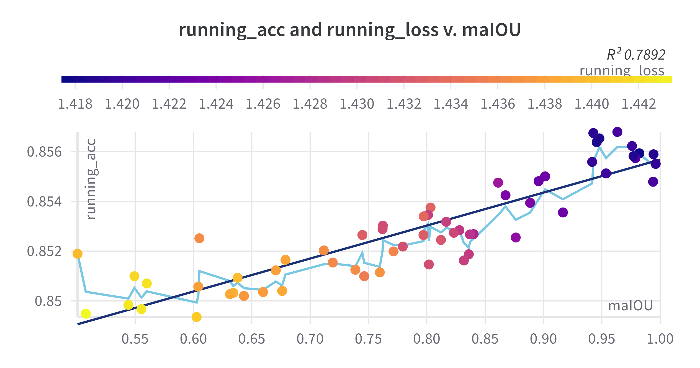
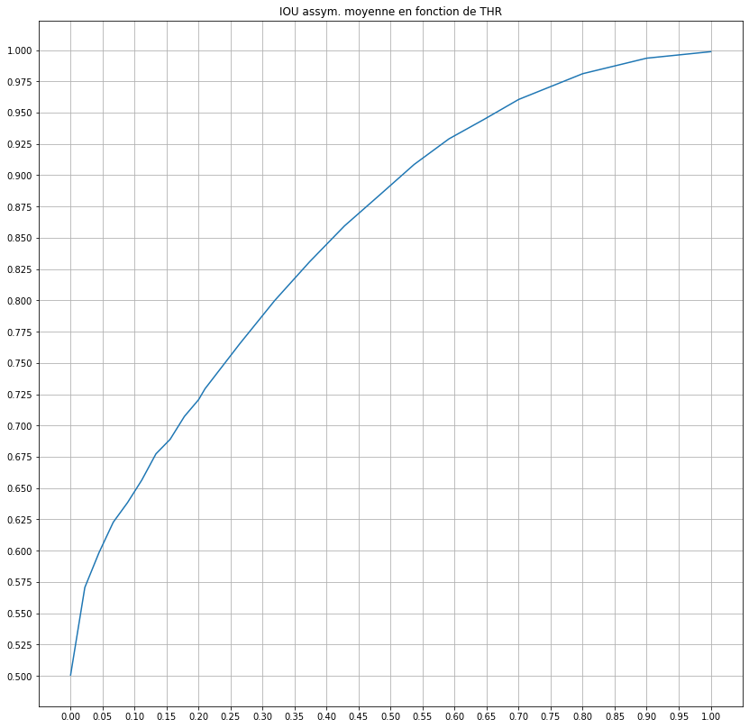
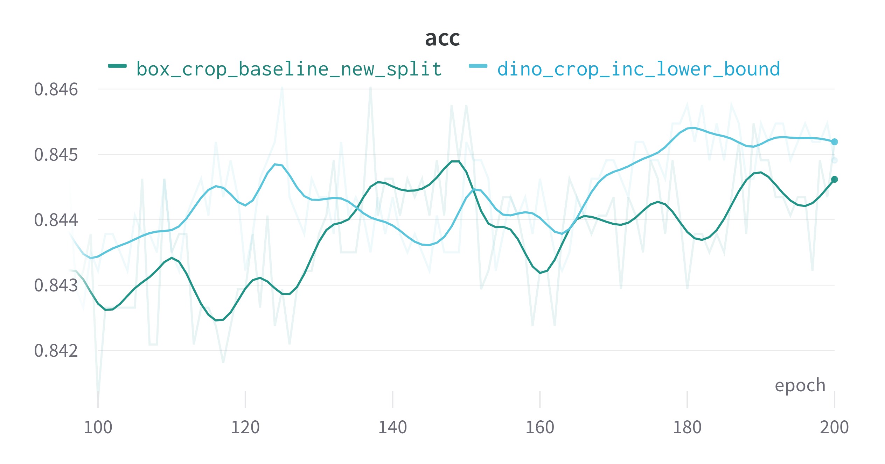

# Experiments using DINO/SAM to crop images and enhance training for Resnet50 model 

## Introduction, motivation and goals

The goal of this project is to use knowledge from SAM and DINO to improve the training of a Resnet50 model trained with a SOTA training recipe (generally used on ImageNet). The baseline recipe can be found in the [baseline pruning repo](https://github.com/brain-bzh/baseline-pruning). It has been adapted by removing the cutmix and mixup augmentations (because the model perormed poorly with them), and adding color-wise augmentatons instead of geometry and random erasing that could affect the object of interest.

The idea is to use the self-attention maps from the DINO and SAM's masks to generate pseudo ground truth boxes for the images in the dataset. These boxes will be used to crop the images and enhance the training of the model.

Using those boxes in combination with the `LocalizedRandomResizedCrop` function will effectively improve the performance of a Resnet model trained with the baseline recipe by up to 0.6% accuracy.

This has been tested on the CUB dataset with different values of mean asymetric intersection over union (maIoU, defined as the intersection over the gt box). The result is a nearly affine relationship between the maIoU and the accuracy of the model. The accuracy after the first training is 84.97%. The 




For reference, the running accuracy after the second training with the RandomResizedCrop is 85.01% on average with a standard deviation of 0.076% (over 9 runs).


Note that all the subsequent experiments are done on the CUB dataset with the Resnet50 model as a backbone.
## The `LocalizedRandomResizedCrop` function

The `LocalizedRandomResizedCrop` function takes a maiou threshold as a hyperparameter and generates a crop centered on the pseudo gt box with an aiou greater than the threshold. The crop is then resized to the input size of the model.

This works by generating a random shape for the crop (size and aspect ratio). The lower bound of the scale is constrained by the size of the pseudo gt box as the area of the crop has to be greater than 
the threshold times the area of the pseudo gt box. 
$$
scale_{eff}\sim U(\max(scale_{min},thr \frac{A_O}{A_I}),scale_{max})
$$
where $scale_{eff}$ is the effective scale of the crop, $scale_{min}$ and $scale_{max}$ are the lower and upper bounds of the scale, $A_O$ and $A_I$ are the areas of the pseudo gt box and the image.

Then, translation ranges are computed on both axes to move the crop around the pseudo gt box. 
The formula to compute the translation ranges is the following:
$$
\begin{cases}
      x_r = \alpha \frac{W_C+W_O}{2}\\
y_r = \alpha \frac{H_C+H_O}{2}
\end{cases}
$$
where $W_C$ and $H_C$ are the width and height of the crop, $W_O$ and $H_O$ are the width and height of the pseudo gt box and and $\alpha = 1 - \sqrt{thr}$.

Note that the parameter that is controlled is $thr$ and not the maIoU. It is possible to approximate the maIoU for a given $thr$ by computing the mean of the aiou for the crops generated with this $thr$.



The following approximation is not perfect but it is good enough to be used as a proxy for the maIoU.

$$
2(maIOU-0.5) =  thr^{0.4}
$$

## Using boxes

### SAM

Run generate_mask.py to generate masks for the images in the dataset. 

Masks format: 
- name: {image_name}.pt
- shape: (N_masks, H,W) where N_masks is the number of masks for the image, (H,W) is the shape of the og image
- device = cpu

The script will create 
- a folder masks_{i} (i is the number of the run)
- an error file called errors.txt
- an info file called masks_info.json
- all the masks 

The `generate_bbox.py` script will generate use the boxes from the masks and needs a pretrained model to run. The pseudo-gt boxes is the one with the maxiumum logits value for the gt class.

Computed IOU for the masks' bounding boxes and the ground truth bounding boxes is about 0.5

### DINO

It's possible to generate the pseudo gt boxes for the images by first thresholding the self-attention maps and the computing the following values:
```
center_y, center_x = np.mean(np.argwhere(threshed),axis=0)

h = np.sum(threshed.max(axis=1),axis=0)
w = np.sum(threshed.max(axis=0),axis=0)
```

Computed IOU for the pseudo gt boxes and the ground truth bounding boxes is about 0.6. The asymetric IOU (normalised by the area of the gt box) is even higher, around 0.9, meaning that the pseudo gt boxes are bigger than the gt boxes.

## Using self-attention maps as 2D density maps

The implementation in the `dino_transform.py` is adapated from the `LocalizedRandomResizedCrop` from torchvision transforms, but generates the center of the crop using the self-attention maps as density maps.

These maps are extracted from the self-attention maps of the last layer of the transformer and cleaned using the following steps:
- Average over the heads
- Outlier removal (remove the max and replace it by the mean)\*
- Apply a gaussian filter (Convolution with a gaussian kernel filled with ones)
- Apply a min max normalization (optional)
- Apply a softmax

We control the temperature of the Softmax $T$ defined as 

$$
\text{softmax}_T(x_i) = \frac{\exp(x_i/T)}{\sum_j \exp(x_j/T)}
$$

\* It was observed that the max value of the self-attention maps was an outlier and was removed to avoid the crop to be centered on the same point for all the images.

The center of the crop is then sampled from the density map as discrete probability distribution. Thus, the more attention a point gets, the more likely it is to be sampled as the center of the crop. In general, the crop will be centered on the object of interest.

*This could be extended to the training of a transformer model in a self-distillation fashion, where we use the trained model to generate the density maps on the images where it performs well and train itself with the crops generated from those maps. This would allow the model to focus on the objects of interest and ignore the background, renforcing the attention on the objects of interest.*

## Results

### IOU for the boxes

| Model used | IOU | Total Time |
| --- | --- | --- |
| SAM | 50.12 | 7 hrs + 20 min\*\* |  
| DINO | 61.57 | <15 min |

\** 7 hrs for the masks and 20 min for the boxes. 

SAM is much slower because
- it needs to generate the masks first, adding a very time-consuming step to the pipeline
- it really works better with the Huge Transformer model, while DINO already works well with the small one.
- the Automatic Mask Generator is quite slow, as it calls the mask decoder for each point in the prompt grid.

Looking at the performances, both computation time and IOU, it was decided to use DINO to generate the pseudo gt boxes.

### Accuracy using the boxes

Then, the model is trained with the `LocalizedRandomResizedCrop` function using the pseudo gt boxes generated with DINO and a thr of 1, as it it supposed to give the best results. There are 2 configs for the box inference: using the vanilla DINO model and finetuning only the CLS token. The results are the following: **85.6%** with the vanilla model and **85.8%** with the finetuned model. This configuration matches the results obtained with the ground truth boxes, meaning that the pseudo gt boxes are good enough to be used for training.

To ensure that the results are not biased by the fact that CUB is part of the training set of the DINOv2 model, the train/val split of the dataset is consisent with the one used by DINOv2.
Also, the only information used by the Resnet model is spatial, not semantic.

### Accuracy using the self-attention maps as density maps

First, note that the GPU memory usage is slighly higher when using the self-attention maps as density maps. The maps are computed and not stored. It also slows down the dataloader as the maps are computed in the `__getitem__` method, making the loader process the whole dataset in twice the time it would take without the maps (8 min 36s vs 4 min 7s). Even worse, on a RTX 3090 with 24GB of VRAM, the model takes about 6 min to train a single epoch, while it takes 30s without the maps. 

The tests show that this time does not depend on the batch size, meaning that the operations are done sequentially. This is probably due to the fact that the maps are computed in the `__getitem__` method, which is called sequentially by the dataloader. This could be fixed by computing the maps in the `__init__` method and storing them in a list, but this would require a lot of memory.

Also, because we use CUDA, it is currently not possible to correctly use multiprocessing to speed up the computation of the maps. CUDA can not be reinitialiszed in a forked process, so the maps have to be computed in the main process, with only one worker. 
The workaround is to use the `spawn` method of multiprocessing, but this is not optimal, because several instances of the model are created and the GPU memory usage is higher. That being said, the computation of the maps is parallelized (on the CPU for the workers, still on CUDA for the inference of the maps), so it is faster than the sequential version. With 4 workers, on a TITAN RTX,
the duration of an epoch is 4 min 30s, versus 7 min 30s for the sequential version.

Following is a comparison between a training with the `LocalizedRandomResizedCrop` function and the ground truth boxes and a training with the self-attention maps as density maps. The results are very similar, with a slight advantage for the ground truth boxes. My hypothesis is that DiNO having a better semantic understanding of the images, the density maps are more focused on what's important, meaning that we not only crop on the object of interest but on the most important part of the object of interest: the "discriminative" part.



Note : those results are not to be compared with the results obtained with the ground truth boxes, as the train/val split is different. The baseline accuracy for this particular split is 84.32% (average over the last 100 epochs, last registered acc is 84.35%, first registered acc of the new training is 84.297%).


## Conclusion

Using the self-attention maps as density maps is a good way to generate pseudo gt boxes for the images in the dataset. The results are very similar to the ones obtained with the ground truth boxes. Generating boxes with DINO is much faster than with SAM, and the results are better. 

## Appendix

How to configure the training (in the `config.py` file):

- `wandb`: ` : if True, logs the results on wandb
- `sweeprun` : if True, runs a wandb sweep
- `sweep` : parameters of the run (`resume`, `count`, `id`)

- `source`: source of the boxes (json file or `"gt"`)

- `save` : if True, saves the model at the end of the training

- `augment` : if True, uses non geometric augmentations (color jitter, autocontrast, equalize, posterize, solarize, ...)

- `augment_p` : probability of applying the augmentations

- `use_augment_mix` : if True, uses AugMix , not tested

- `use_box` : if True, uses the LocalizedRandomResizedCrop function, else uses the RandomResizedCrop function

- `use_dino_maps` : if True, uses the self-attention maps as density maps

- `log_interval` : interval between 2 logs, usually 1

- `num_epochs` : number of epochs

- `image_size` : size of the input images, must be a multiple of the patch size when using DINO

- `patch_size` : size of the patches

- `num_workers` : number of workers for the dataloader

- `batch_size` : batch size

- `deterministic` : if True, sets the seed

- `seed` : seed

- `model` :

      - type : type of the model, must be "resnet50" or "dinov2_vit{size}14" with size in [small, base, large, huge] 
      - n_classes : number of classes
      - ema_step  : number of steps for the exponential moving average of the weights
      - freeze_backbone : if True, freezes the backbone
      - train_cls : if True, trains the CLS token 
      - resumed_model : path to the model to resume or None

- `opt` :

      - type : type of the optimizer, must be "sgd" or "adam" or "adamw"
      - lr : learning rate
      - target_lr : target learning rate 

      - momentum : momentum for the SGD optimizer
      - weight_decay : weight decay

      - scheduler : type of the scheduler, must be "cosine" or "step"
      - step_size : step size for the scheduler
      - gamma : gamma for the scheduler, calculated automatically from the step size and the target learning rate if None


